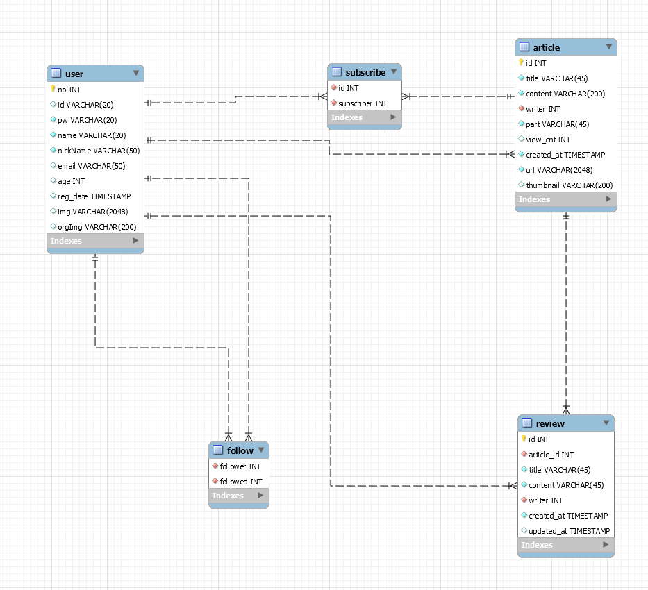

# 관통프로젝트
# SSAFIT Project
**Git Repo** : https://lab.ssafy.com/s09/a07/ssafy9_test

## ⭐ 프로젝트 목표
1. 웹 MVC 아키텍쳐 이해 및 프로젝트 적용
2. Spring Framework 이해 및 RESTful 방식으로 웹 서버 구축
3. MyBatis Framework를 활용하여 DB연동

## ⭐ 작업 순서
1. 프로젝트 요구사항 정리 및 STS SpringBoot프로젝트 생성
2. ERD 작성 및 DB구축
3. Spring Framework 제작
4. MyBatis Framework를 활용하여 DB연동 하는 mapper 작성
5. swagger와 restAPI를 활용한 test

## ⭐ 요구사항-기본

### ERD 작성 및 DB 구축

### Fuction 2 운동 영상 요청

#### 1-1. 운동영상 조회수
- 예시 이미지

  
- 상세

- 적용 알고리즘

## ⭐ 진행도
### 04 / 14
### [+] 추가
- 프로젝트 명세서 작성 및 기본 기능 작성

### 04 / 18
### [+] 추가
- 알고리즘 구현 완료

### 04 /27
### [+] 추가
-프론트 엔드 및 백엔드 구현

### 05 / 13
### [+] 추가
- API 연결 완료

### 05 / 24
### [+] 추가
- AWS를 통한 서버 배포 및 백엔드 서버 연결 완료

### 05 / 26
### [-] 수정
- 유저 피드백 반영 기능 수정

### [+] 추가
- 배포 완료

